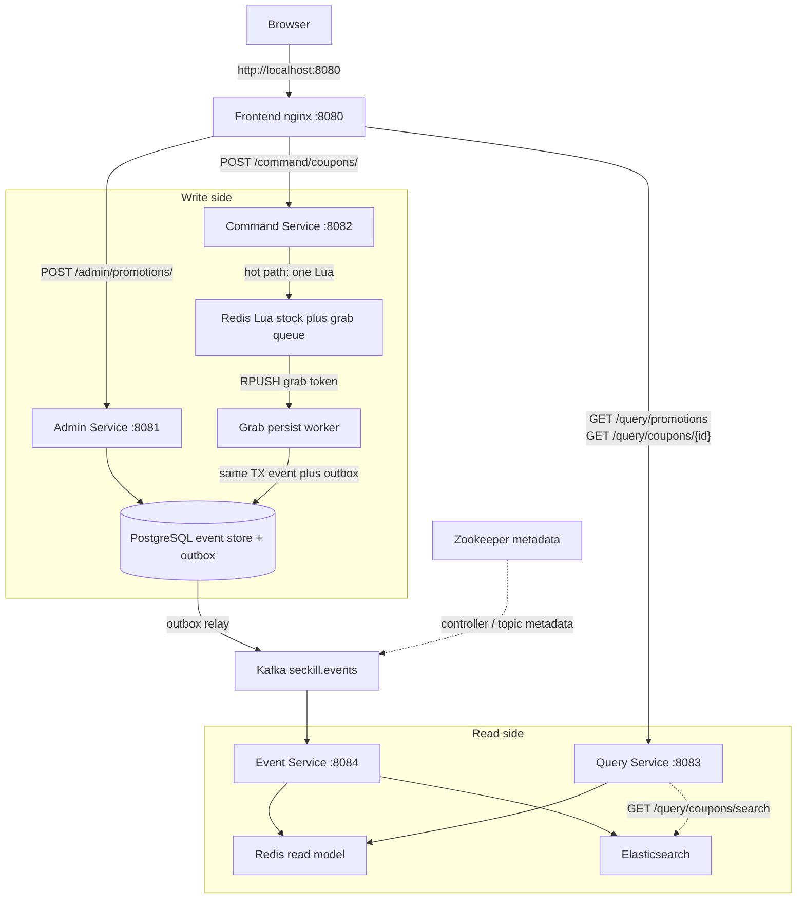
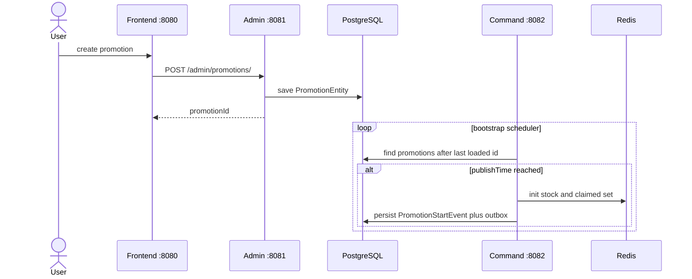
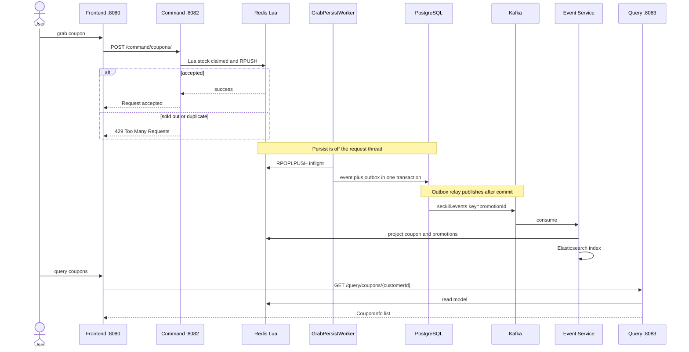

# ServiceComb Demo - SecKill [](https://travis-ci.org/ServiceComb/seckill)[](https://coveralls.io/github/ServiceComb/seckill)[](https://www.apache.org/licenses/LICENSE-2.0.html)

## Purpose
In order for users to better understand how to develop micro-services using ServiceComb, and learning event sourcing.

## Architecture of SecKill

CQRS + Event Sourcing, split into four services plus a React UI:

| Service | Port | Role |
|---------|------|------|
| Frontend (React + nginx) | 8080 | UI; reverse-proxy `/admin`, `/command`, `/query` (Event replay is **not** proxied) |
| Admin | 8081 | Promotion management (PostgreSQL) |
| Command | 8082 | Redis Lua hot path (stock + claim + grab queue); async worker writes events + outbox; Kafka via outbox relay |
| Query | 8083 | Read Redis (hot query) and Elasticsearch (search) |
| Event | 8084 | Kafka consumer, project Redis/ES; `POST /admin/replay` rebuilds from PostgreSQL |

Docker Compose also starts supporting infrastructure (not called by the browser):

| Infra | Port | Role |
|-------|------|------|
| PostgreSQL | 5432 | Write-side promotions, append-only events, transactional outbox |
| Redis | 6379 | Lua stock/claim hot path **and** Query read model |
| Kafka | 9092 | `seckill.events` (key = `promotionId`) and DLT `seckill.events.dlt` |
| Zookeeper | 2181 | Kafka cluster coordination only (controller election, topic/broker metadata). **Not** on the grab/query path |
| Elasticsearch | 9200 | Search/stats projection; existing Query GETs still use Redis |

This compose uses ZooKeeper-mode Kafka (`wurstmeister/kafka` + `KAFKA_ZOOKEEPER_CONNECT`). Kafka 3.x KRaft can store the same metadata inside Kafka and drop Zookeeper; this demo does not. Tests use in-memory Redis/Kafka/ES plus H2 (`seckill.infra.mode=memory`, the default). Production profile `prd` points at the compose hosts.

More detail on Command internals: [Command Micro-Service Architecture][cmsa]

### System architecture



### Data flow

**1. Create a promotion and activate it**



**2. Grab a coupon**



**3. Event types and read-model projection**

| Event | Write side | Read side (Event Service) |
|-------|------------|---------------------------|
| `PromotionStartEvent` | Redis stock initialized; event in PostgreSQL | Redis active promotion + ES promo doc |
| `CouponGrabbedEvent` | Lua claim plus queue; worker persists; unique (promotionId, customerId) | Redis coupon + ES coupon doc `id=pid:customerId` |
| `PromotionFinishEvent` | Stock 0 after last persist, or finishTime once the grab queue is empty | Remove Redis promotion; ES finished flag |

Duplicates are ignored by unique constraint and Redis SET. HTTP `200` means Redis has claimed the coupon; Query lags until the worker and outbox catch up. Unpersisted grab tokens live in Redis lists (`seckill:grabs` / `seckill:grabs:inflight`) and require Redis persistence across restarts. If Redis is empty, Command rebuilds stock from the event table. Kafka key is `promotionId` so one promotion is ordered; projector still buffers `seq` gaps and can `POST /admin/replay?promotionId=&fromSeq=` from PostgreSQL. Failed projections go to `seckill.events.dlt`.


[cmsa]: https://github.com/ServiceComb/seckill/tree/master/seckill-command-service/README.md

## Tech Stack

This is an Apache ServiceComb seckill demo for microservice development and Event Sourcing.

| Layer | Technology |
|------|------|
| Language / JDK | Java 8 |
| Build | Maven multi-module (`0.2.0-SNAPSHOT`) |
| Application | Spring Boot **1.4.5.RELEASE** |
| Microservice | Apache ServiceComb 0.2.0 (`spring-boot-starter-provider` + `transport-rest-vertx`) |
| Web / REST | Spring MVC (`spring-boot-starter-web`) |
| Persistence | Spring Data JPA + PostgreSQL (H2 for tests); Redis Lua hot path and read model |
| Messaging | Kafka (`seckill.events` / `seckill.events.dlt`) via transactional outbox; Zookeeper only for this Kafka image |
| Search | Elasticsearch (coupon/promotion projection) |
| Container | Docker, Docker Compose; Java images from a multi-stage Dockerfile; frontend is React + nginx |
| CI / Quality | Travis CI, JaCoCo, Coveralls, Pact contract tests |

The React UI is served at http://localhost:8080 (create promotions, grab coupons, query results). APIs can still be called with curl or Postman. Nginx only forwards `/admin`, `/command`, and `/query`; call Event Service on `:8084` directly.

This sample uses older stacks (Spring Boot 1.4, ServiceComb 0.2), not current mainstream versions.

## HTTP APIs

Paths below work through the frontend (`http://localhost:8080/...`) except replay.

| Method | Path | Service | Notes |
|--------|------|---------|-------|
| `POST` | `/admin/promotions/` | Admin | Body: `numberOfCoupons`, `discount`, `publishTime`, `finishTime` (epoch millis). Returns `promotionId` |
| `PUT` | `/admin/promotions/{promotionId}` | Admin | Update before `PromotionStartEvent` exists |
| `POST` | `/command/coupons/` | Command | Body: `promotionId`, `customerId`. `200` means Redis claimed (Query lags until worker + outbox); sold out / duplicate is `429` (often surfaced as HTTP `400` with `InvocationException`) |
| `GET` | `/query/promotions` | Query | Active promotions from Redis |
| `GET` | `/query/coupons/{customerId}` | Query | Coupons from Redis |
| `GET` | `/query/coupons/search?customerId=&promotionId=` | Query | Elasticsearch (empty list if the index is missing) |
| `POST` | `/admin/replay?promotionId=&fromSeq=0` | Event `:8084` | Rebuild Redis/ES from PostgreSQL events |

Spring Boot actuator health: `http://localhost:8081/health` … `:8084/health`.

## Modules

- `seckill-event-store`: envelope, promotion/event/outbox JPA models
- `seckill-infra-redis` / `seckill-infra-kafka` / `seckill-infra-es`: Redis, Kafka, Elasticsearch clients (in-memory fallbacks for tests)
- `seckill-command-service` / `seckill-admin-service` / `seckill-query-service` / `seckill-event-service`: the four services above
- `frontend`: React UI (nginx reverse-proxies `/admin`, `/command`, `/query`)

## Prerequisites
You will need:
1. [Oracle JDK 1.8+][jdk]
2. [Maven 3.x][maven]
3. [PostgreSQL][postgres] (or Docker Compose, which also starts Redis, Kafka, Zookeeper, Elasticsearch)
4. [Docker][docker]
5. [Docker machine(optional)][docker_machine]
6. [curl][curl] or [Postman][postman]

[jdk]: http://www.oracle.com/technetwork/java/javase/downloads/jdk8-downloads-2133151.html
[maven]: https://maven.apache.org/install.html
[postgres]: https://www.postgresql.org/download/
[docker]: https://www.docker.com/get-docker
[docker_compose]: https://docs.docker.com/compose/install/
[docker_machine]: https://docs.docker.com/machine/install-machine/
[curl]: https://curl.haxx.se
[postman]: https://www.getpostman.com/

## Run Services

Preferred: start the full stack with Compose (PostgreSQL, Redis, ZooKeeper, Kafka, Elasticsearch, four Java services, frontend). Images in `docker-compose.yml` use the Huawei Cloud prefix `swr.cn-north-4.myhuaweicloud.com/ddn-k8s/docker.io/`.

```bash
docker compose up -d --build
```

Java services take about 30 seconds after containers are up. Then open http://localhost:8080.

Local jar mode: set `application.properties` (or `spring.profiles.active=prd`) and run `java -jar target/seckill/seckill-xxx-service-xxx-exec.jar`. Tests stay on `seckill.infra.mode=memory` (in-memory Redis/Kafka/ES + H2).

Optional Maven image build: `mvn package -Pdocker`. Docker Toolbox: add `-Pdocker-machine`.

## Run Integration Tests

```
mvn verify -Pdocker
```

Docker Toolbox: add `-Pdocker-machine`.

## Verify services

UI: create a promotion, grab a coupon, then query. Same flow via curl (wait until Command bootstrap has started the promotion; `publishTime` in the past or now):

```bash
NOW=$(date +%s)000
FINISH=$((NOW + 86400000))

# create
PROM=$(curl -sS -X POST http://localhost:8080/admin/promotions/ \
  -H 'Content-Type: application/json' \
  -d "{\"numberOfCoupons\":5,\"discount\":0.7,\"publishTime\":$NOW,\"finishTime\":$FINISH}")
echo "$PROM"

# list (Redis)
curl -sS http://localhost:8080/query/promotions

# grab, then duplicate (should fail)
curl -sS -X POST http://localhost:8080/command/coupons/ \
  -H 'Content-Type: application/json' \
  -d "{\"promotionId\":$PROM,\"customerId\":\"tester1\"}"
curl -sS -X POST http://localhost:8080/command/coupons/ \
  -H 'Content-Type: application/json' \
  -d "{\"promotionId\":$PROM,\"customerId\":\"tester1\"}"

# Redis read model, then Elasticsearch search
curl -sS http://localhost:8080/query/coupons/tester1
curl -sS "http://localhost:8080/query/coupons/search?customerId=tester1"

# optional replay (Event Service, not through nginx)
curl -sS -X POST "http://localhost:8084/admin/replay?promotionId=$(echo $PROM | tr -d '"')&fromSeq=0"
```

Expected: first grab `200 Request accepted`; duplicate rejected; both query and search return the coupon. Command logs should show `PromotionEntity started` and no `Outbox relay failed`.

Postman screenshots of the original flow: [create](https://github.com/ServiceComb/seckill/blob/master/etc/CreatePromotion.png), [promotions](https://github.com/ServiceComb/seckill/blob/master/etc/QueryActivePromotions.png), [grab](https://github.com/ServiceComb/seckill/blob/master/etc/RequestGrabCoupon.png), [coupons](https://github.com/ServiceComb/seckill/blob/master/etc/QueryAcquiredCoupons.png).