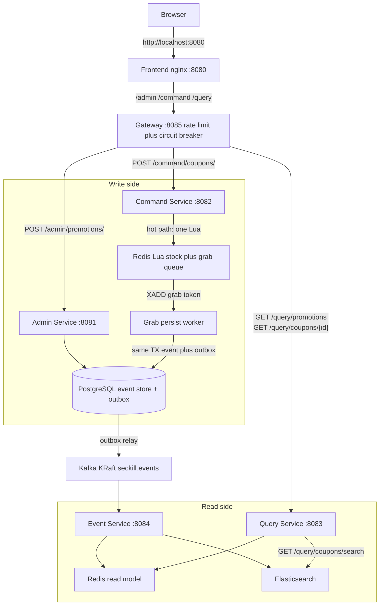
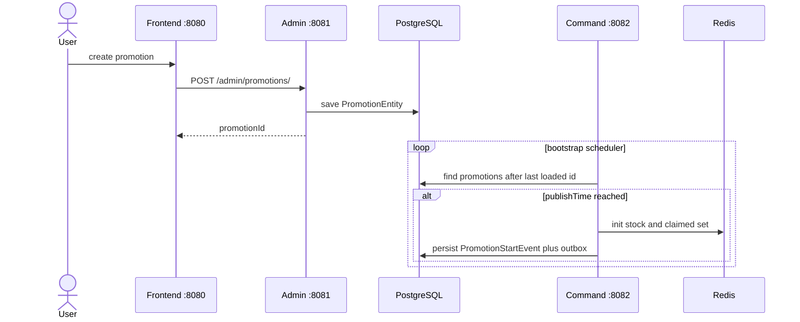
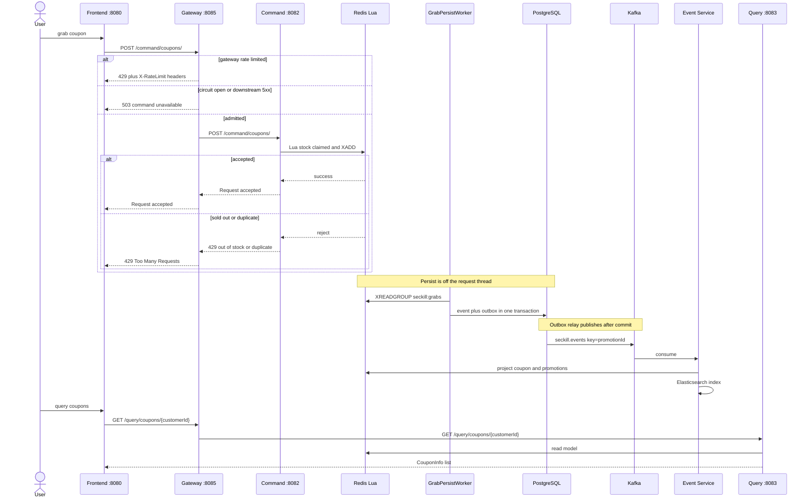

# SecKill [](https://travis-ci.org/ServiceComb/seckill)[](https://coveralls.io/github/ServiceComb/seckill)[](https://www.apache.org/licenses/LICENSE-2.0.html)

## Purpose

A flash-sale (seckill) sample for **CQRS + Event Sourcing**: Redis Lua claims stock on the hot path, PostgreSQL stores append-only events behind a transactional outbox, Kafka fans events out, and Query reads Redis / Elasticsearch.

It began as an Apache ServiceComb demo. HTTP is now **Spring MVC on Spring Boot 3** (Jakarta EE). ServiceComb Vert.x 0.2 is not part of the runtime.

## Architecture of SecKill

Five Java services plus a React UI live under **`service/`**. Shared Maven libraries live under **`library/`**. Tests and JMeter live under **`test/`**.

| Service | Folder | Port | What it does |
|---------|--------|------|----------------|
| Frontend | [`service/frontend/`](service/frontend/) | 8080 | React UI; nginx reverse-proxies `/admin`, `/command`, `/query` to Gateway (replay is **not** proxied) |
| Gateway | [`service/seckill-gateway/`](service/seckill-gateway/) | 8085 | Spring Cloud Gateway: Redis/in-memory rate limit + Resilience4j circuit breaker |
| Admin | [`service/seckill-admin-service/`](service/seckill-admin-service/) | 8081 | Create/update promotions in PostgreSQL |
| Command | [`service/seckill-command-service/`](service/seckill-command-service/) | 8082 | Redis Lua grab; async persist events + outbox; relay to Kafka |
| Query | [`service/seckill-query-service/`](service/seckill-query-service/) | 8083 | Read Redis (hot) and Elasticsearch (search) |
| Event | [`service/seckill-event-service/`](service/seckill-event-service/) | 8084 | Consume Kafka, project Redis/ES; `POST /admin/replay` |

Docker Compose also starts supporting infrastructure (not called by the browser):

| Infra | Port | Role |
|-------|------|------|
| PostgreSQL | 5432 | Write-side promotions, append-only events, transactional outbox |
| Redis | 6379 | Lua stock/claim hot path, Query read model, **and** Gateway token-bucket rate limit in `prd` |
| Kafka | 9092 | KRaft `seckill.events` (key = `promotionId`) and DLT `seckill.events.dlt` |
| Elasticsearch | 9200 | Search/stats projection; existing Query GETs still use Redis |

Kafka runs in **KRaft** mode (`apache/kafka`, combined broker + controller). There is no ZooKeeper.

Tests use in-memory Redis/Kafka/ES plus H2 (`seckill.infra.mode=memory`, the default). Profile `prd` points at the Compose hostnames (`*.servicecomb.io` aliases).

More detail on Command internals: [Command Micro-Service Architecture](service/seckill-command-service/README.md).

### System architecture



### Data flow

**1. Create a promotion and activate it**



**2. Grab a coupon**



**3. Event types and read-model projection**

| Event | Write side | Read side (Event Service) |
|-------|------------|---------------------------|
| `PromotionStartEvent` | Redis stock initialized; event in PostgreSQL | Redis active promotion + ES promo doc |
| `CouponGrabbedEvent` | Lua claim plus queue; worker persists; unique `(promotionId, customerId)` | Redis coupon + ES coupon doc `id=pid:customerId` |
| `PromotionFinishEvent` | Stock 0 after last persist, or finishTime once the grab queue is empty | Remove Redis promotion; ES finished flag |

Duplicates are ignored by the unique constraint and the Redis claimed set. HTTP `200` means Redis has claimed the coupon; Query lags until the worker and outbox catch up. Unpersisted grab tokens live in Redis stream `seckill:grabs` (consumer group `persist`) and need Redis durability across restarts. If Redis is empty, Command rebuilds stock from the event table. Kafka key is `promotionId` so one promotion is ordered; the projector still buffers `seq` gaps and can `POST /admin/replay?promotionId=&fromSeq=` from PostgreSQL. Failed projections go to `seckill.events.dlt`.


## Tech Stack

| Layer | Technology |
|------|------|
| Language / JDK | Java 17 |
| Build | Maven 3.9+ multi-module (`0.2.0-SNAPSHOT`) |
| Application | Spring Boot **3.3.13** + Spring Cloud **2023.0.5** (Gateway) |
| Web / REST | Spring MVC on Admin/Command/Query/Event; Spring Cloud Gateway (WebFlux) at the edge |
| Persistence | Spring Data JPA + PostgreSQL (H2 for tests); Redis Lua (Jedis 5) for hot path and read model |
| Edge | Gateway token bucket (in-memory tests / Redis in `prd`) + Resilience4j circuit breaker (5xx/timeout; **not** business 429) |
| Messaging | Kafka 3.8 KRaft (`seckill.events` / `seckill.events.dlt`) via transactional outbox |
| Search | Elasticsearch 7.17 (coupon/promotion projection) |
| Container | Docker Compose; Java 17 multi-stage `docker/Dockerfile`; frontend is React + nginx |
| CI / Quality | Travis CI (`openjdk17`), JaCoCo, Coveralls |

The UI is http://localhost:8080. Nginx forwards `/admin`, `/command`, and `/query` to Gateway `:8085`. Call Event Service on `:8084` for replay (not on the Gateway). Actuator health is `http://localhost:8081/health` … `:8085/health` (`management.endpoints.web.base-path=/`).

## HTTP APIs

Paths below work through the frontend (`http://localhost:8080/...`) except replay.

| Method | Path | Service | Notes |
|--------|------|---------|-------|
| `POST` | `/admin/promotions/` | Admin | Body: `numberOfCoupons`, `discount`, `publishTime`, `finishTime` (epoch millis). Returns `promotionId` |
| `PUT` | `/admin/promotions/{promotionId}` | Admin | Update before `PromotionStartEvent` exists |
| `POST` | `/command/coupons/` | Command | Body: `promotionId`, `customerId`. `200` = Redis claimed (Query lags until worker + outbox); sold out / duplicate = **HTTP 429** with a plain-text reason. Gateway quota exceeded is also **429** but with `X-RateLimit-*` headers and an empty body |
| `GET` | `/query/promotions` | Query | Active promotions from Redis (no trailing slash) |
| `GET` | `/query/coupons/{customerId}` | Query | Coupons from Redis |
| `GET` | `/query/coupons/search?customerId=&promotionId=` | Query | Elasticsearch (empty list if the index is missing) |
| `POST` | `/admin/replay?promotionId=&fromSeq=0` | Event `:8084` | Rebuild Redis/ES from PostgreSQL events |

## Where to review the code

Java lives under each module’s `src/main/java/io/servicecomb/poc/demo/`. Shared code under `library/` is not an HTTP process; Command / Query / Event depend on those jars.

```
seckill/
├── service/
│   ├── frontend/                    # UI + nginx :8080 → Gateway
│   ├── seckill-gateway/             # Gateway :8085
│   ├── seckill-admin-service/       # Admin :8081
│   ├── seckill-command-service/     # Command :8082
│   ├── seckill-query-service/       # Query :8083
│   └── seckill-event-service/       # Event :8084
├── library/
│   ├── seckill-event-store/         # JPA models + event envelope
│   ├── seckill-infra-redis/         # Redis Lua + read model
│   ├── seckill-infra-kafka/         # Kafka producer / consumer
│   ├── seckill-infra-es/            # Elasticsearch HTTP client
├── test/
│   ├── test-support/                # HTTP 429/400 mapping (used by Admin + Command)
│   ├── integration-test/            # in-process end-to-end tests
│   ├── performance-test/            # JMeter
│   └── coverage-aggregate/          # JaCoCo aggregate report
├── docker/Dockerfile                # Java 17 multi-stage images
└── docker-compose.yml
```

### Gateway — [`service/seckill-gateway/`](service/seckill-gateway/)

**Function:** single HTTP edge for Admin / Command / Query. Per-IP token bucket (command 50/s burst 100; query 100/s; admin 10/s). Resilience4j circuit breaker treats **500–504 and timeouts** as failures and returns `503` with `command unavailable` / `query unavailable` / `admin unavailable`. Business **429** from Command is passed through and does **not** open the circuit. Event replay stays off this gateway. Tests use `seckill.gateway.rate-limiter=memory`; Compose `prd` uses Redis.

| Review | Path |
|--------|------|
| Boot | [`GatewayApplication.java`](service/seckill-gateway/src/main/java/io/servicecomb/poc/demo/GatewayApplication.java) |
| Routes, IP key, CB status codes | [`GatewayConfiguration.java`](service/seckill-gateway/src/main/java/io/servicecomb/poc/demo/seckill/gateway/GatewayConfiguration.java) |
| Memory vs Redis limiter | [`GatewayRateLimiterConfiguration.java`](service/seckill-gateway/src/main/java/io/servicecomb/poc/demo/seckill/gateway/GatewayRateLimiterConfiguration.java) |
| Fallback `503` | [`web/GatewayFallbackController.java`](service/seckill-gateway/src/main/java/io/servicecomb/poc/demo/seckill/web/GatewayFallbackController.java) |

### Admin — [`service/seckill-admin-service/`](service/seckill-admin-service/)

**Function:** write-side promotion CRUD. Does not touch Redis or Kafka.

| Review | Path |
|--------|------|
| Boot | [`AdminServiceApplication.java`](service/seckill-admin-service/src/main/java/io/servicecomb/poc/demo/AdminServiceApplication.java) |
| HTTP `POST/PUT /admin/promotions` | [`web/SecKillAdminRestController.java`](service/seckill-admin-service/src/main/java/io/servicecomb/poc/demo/seckill/web/SecKillAdminRestController.java) |
| Promotion table | [`SpringPromotionRepository.java`](library/seckill-event-store/src/main/java/io/servicecomb/poc/demo/seckill/repositories/spring/SpringPromotionRepository.java) in `seckill-event-store` |

### Command — [`service/seckill-command-service/`](service/seckill-command-service/)

**Function:** hot-path grab (Lua), async persist, outbox → Kafka, start/finish promotions, recover empty Redis. Extra notes: [Command README](service/seckill-command-service/README.md).

| Review | Path |
|--------|------|
| Boot | [`CommandServiceApplication.java`](service/seckill-command-service/src/main/java/io/servicecomb/poc/demo/CommandServiceApplication.java) |
| HTTP `POST /command/coupons/` | [`web/SecKillCommandRestController.java`](service/seckill-command-service/src/main/java/io/servicecomb/poc/demo/seckill/web/SecKillCommandRestController.java) |
| Grab orchestration | [`SecKillCommandService.java`](service/seckill-command-service/src/main/java/io/servicecomb/poc/demo/seckill/SecKillCommandService.java) |
| Persist worker (Redis stream) | [`GrabPersistWorker.java`](service/seckill-command-service/src/main/java/io/servicecomb/poc/demo/seckill/GrabPersistWorker.java) |
| Same TX event + outbox | [`TransactionalEventOutboxWriter.java`](service/seckill-command-service/src/main/java/io/servicecomb/poc/demo/seckill/TransactionalEventOutboxWriter.java) |
| Outbox → Kafka | [`OutboxRelay.java`](service/seckill-command-service/src/main/java/io/servicecomb/poc/demo/seckill/OutboxRelay.java) |
| Schedule start / finish | [`SecKillPromotionBootstrap.java`](service/seckill-command-service/src/main/java/io/servicecomb/poc/demo/seckill/SecKillPromotionBootstrap.java) |
| Rebuild stock from events | [`SecKillRecoveryService.java`](service/seckill-command-service/src/main/java/io/servicecomb/poc/demo/seckill/SecKillRecoveryService.java) |
| Beans | [`SecKillCommandConfig.java`](service/seckill-command-service/src/main/java/io/servicecomb/poc/demo/seckill/SecKillCommandConfig.java) |

### Query — [`service/seckill-query-service/`](service/seckill-query-service/)

**Function:** read model only (no PostgreSQL). Redis for lists; ES for search.

| Review | Path |
|--------|------|
| Boot (JPA/DB auto-config off) | [`QueryServiceApplication.java`](service/seckill-query-service/src/main/java/io/servicecomb/poc/demo/QueryServiceApplication.java) |
| `GET /query/promotions`, coupons, search | [`web/SeckillQueryRestController.java`](service/seckill-query-service/src/main/java/io/servicecomb/poc/demo/seckill/web/SeckillQueryRestController.java) |
| Legacy `GET /sync/{id}` | [`web/SecKillSyncRestController.java`](service/seckill-query-service/src/main/java/io/servicecomb/poc/demo/seckill/web/SecKillSyncRestController.java) |
| Query logic | [`SecKillQueryService.java`](service/seckill-query-service/src/main/java/io/servicecomb/poc/demo/seckill/SecKillQueryService.java) |

### Event — [`service/seckill-event-service/`](service/seckill-event-service/)

**Function:** Kafka consumer; apply events to Redis + ES in `seq` order; replay from PostgreSQL.

| Review | Path |
|--------|------|
| Boot | [`EventServiceApplication.java`](service/seckill-event-service/src/main/java/io/servicecomb/poc/demo/EventServiceApplication.java) |
| Projection + gap fill | [`EventProjector.java`](service/seckill-event-service/src/main/java/io/servicecomb/poc/demo/seckill/EventProjector.java) |
| `POST /admin/replay` | [`web/ReplayController.java`](service/seckill-event-service/src/main/java/io/servicecomb/poc/demo/seckill/web/ReplayController.java) |
| Consumer wiring | [`SecKillEventConfig.java`](service/seckill-event-service/src/main/java/io/servicecomb/poc/demo/seckill/SecKillEventConfig.java) |

### Shared libraries (not a process)

| Folder | Function | Start review here |
|--------|----------|-------------------|
| [`library/seckill-event-store/`](library/seckill-event-store/) | JPA entities, event types, JSON envelope, outbox row | [`entities/`](library/seckill-event-store/src/main/java/io/servicecomb/poc/demo/seckill/entities/), [`event/`](library/seckill-event-store/src/main/java/io/servicecomb/poc/demo/seckill/event/) |
| [`library/seckill-infra-redis/`](library/seckill-infra-redis/) | Lua stock/claim + grab stream; Query read model | [`JedisSecKillStore.java`](library/seckill-infra-redis/src/main/java/io/servicecomb/poc/demo/seckill/redis/JedisSecKillStore.java) (`GRAB_LUA`) |
| [`library/seckill-infra-kafka/`](library/seckill-infra-kafka/) | Producer, consumer, DLT, in-memory bus for tests | [`KafkaSecKillEventPublisher.java`](library/seckill-infra-kafka/src/main/java/io/servicecomb/poc/demo/seckill/kafka/KafkaSecKillEventPublisher.java), [`KafkaSecKillEventConsumer.java`](library/seckill-infra-kafka/src/main/java/io/servicecomb/poc/demo/seckill/kafka/KafkaSecKillEventConsumer.java) |
| [`library/seckill-infra-es/`](library/seckill-infra-es/) | Index / search coupons and promotions | [`HttpElasticsearchIndex.java`](library/seckill-infra-es/src/main/java/io/servicecomb/poc/demo/seckill/es/HttpElasticsearchIndex.java) |

### Tests — [`test/`](test/)

| Folder | Function |
|--------|----------|
| [`test/test-support/`](test/test-support/) | HTTP 429/400 bodies; also on Admin/Command runtime classpath. [`ApiExceptionHandler.java`](test/test-support/src/main/java/io/servicecomb/poc/demo/seckill/ApiExceptionHandler.java) |
| [`test/integration-test/`](test/integration-test/) | Grab + query in one Spring context |
| [`test/performance-test/`](test/performance-test/) | JMeter; see [README](test/performance-test/README.md) |
| [`test/coverage-aggregate/`](test/coverage-aggregate/) | JaCoCo aggregate |

### Frontend

| Folder | Function |
|--------|----------|
| [`service/frontend/`](service/frontend/) | UI: [`src/App.tsx`](service/frontend/src/App.tsx), [`src/api.ts`](service/frontend/src/api.ts); nginx: [`nginx.conf`](service/frontend/nginx.conf) |

## Prerequisites

1. [JDK 17+][jdk] (required to compile; Compose images already include a JRE)
2. [Maven 3.9+][maven] (or run Maven inside Docker)
3. [Docker][docker] and Compose v2 (`docker compose`)
4. [curl][curl] or [Postman][postman] if you call APIs without the UI

[jdk]: https://adoptium.net/temurin/releases/?version=17
[maven]: https://maven.apache.org/install.html
[docker]: https://www.docker.com/get-docker
[curl]: https://curl.haxx.se
[postman]: https://www.getpostman.com/

## Run Services

Preferred: start the full stack with Compose (PostgreSQL, Redis, Kafka KRaft, Elasticsearch, five Java services, frontend). Images in `docker-compose.yml` use the Huawei Cloud prefix `swr.cn-north-4.myhuaweicloud.com/ddn-k8s/docker.io/`.

```bash
docker compose up -d --build
```

Java services take about 30 seconds after containers are up (Kafka healthcheck included). Then open http://localhost:8080.

Local jar mode (JDK 17): `mvn -DskipTests package`, then `java -jar service/<module>/target/seckill/<artifact>-0.2.0-SNAPSHOT-exec.jar` with `spring.profiles.active=prd` if you are talking to Compose infra. Tests stay on `seckill.infra.mode=memory`.

The Compose file is the only supported stack. There is no ZooKeeper / ActiveMQ / MySQL Compose overlay.

## Run Tests

From the repo root (JDK 17 + Maven 3.9, or the `maven:3.9.9-eclipse-temurin-17` image):

```bash
mvn test
```

This runs unit tests under each `service/` / `library/` module and `test/integration-test` (H2, in-memory Redis/Kafka/ES). You do **not** need `-Pdocker` for that.

Optional fabric8 image build: `mvn package -Pdocker`. Day-to-day images come from `docker compose up --build`.

Load test: [test/performance-test/README.md](test/performance-test/README.md).

## Verify services

UI: create a promotion, grab a coupon, then query. Same flow via curl (wait until Command bootstrap has started the promotion; `publishTime` in the past or now):

```bash
NOW=$(date +%s)000
FINISH=$((NOW + 86400000))

# create
PROM=$(curl -sS -X POST http://localhost:8080/admin/promotions/ \
  -H 'Content-Type: application/json' \
  -d "{\"numberOfCoupons\":5,\"discount\":0.7,\"publishTime\":$NOW,\"finishTime\":$FINISH}")
echo "$PROM"

# list (Redis)
curl -sS http://localhost:8080/query/promotions

# grab, then duplicate (429)
curl -sS -i -X POST http://localhost:8080/command/coupons/ \
  -H 'Content-Type: application/json' \
  -d "{\"promotionId\":$PROM,\"customerId\":\"tester1\"}"
curl -sS -i -X POST http://localhost:8080/command/coupons/ \
  -H 'Content-Type: application/json' \
  -d "{\"promotionId\":$PROM,\"customerId\":\"tester1\"}"

# Redis read model, then Elasticsearch search
curl -sS http://localhost:8080/query/coupons/tester1
curl -sS "http://localhost:8080/query/coupons/search?customerId=tester1"

# optional replay (Event Service, not through nginx)
curl -sS -X POST "http://localhost:8084/admin/replay?promotionId=$(echo $PROM | tr -d '"')&fromSeq=0"
```

Expected: first grab `200` and `Request accepted`; duplicate `429` (`duplicate order`); both query and search return the coupon. Command logs should show `PromotionEntity started` and no `Outbox relay failed`.

Postman screenshots of the original flow: [create](https://github.com/ServiceComb/seckill/blob/master/etc/CreatePromotion.png), [promotions](https://github.com/ServiceComb/seckill/blob/master/etc/QueryActivePromotions.png), [grab](https://github.com/ServiceComb/seckill/blob/master/etc/RequestGrabCoupon.png), [coupons](https://github.com/ServiceComb/seckill/blob/master/etc/QueryAcquiredCoupons.png).
