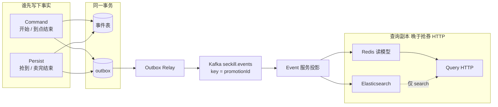
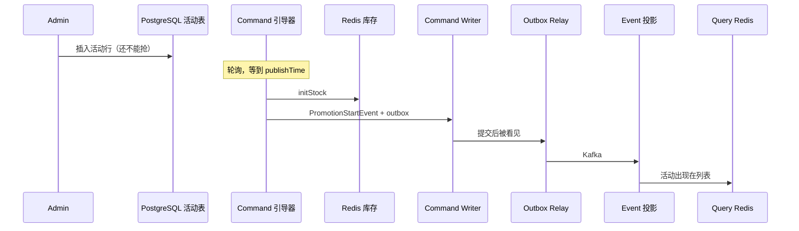
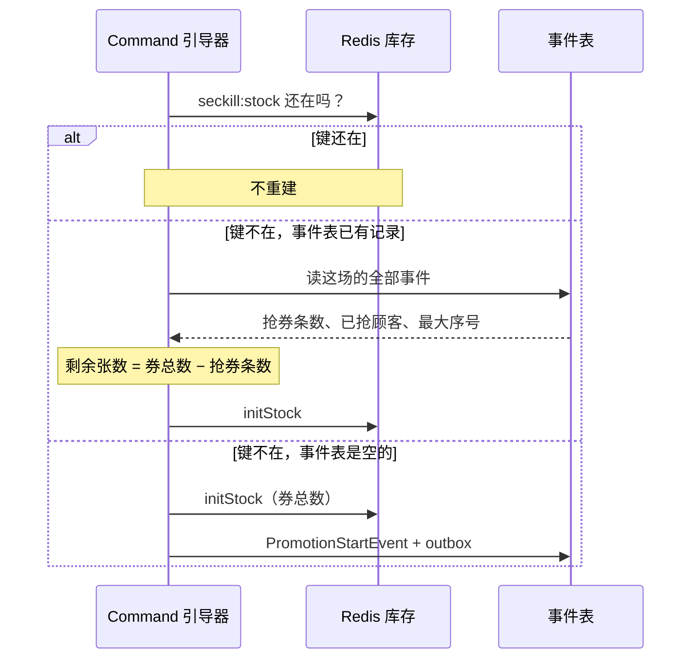
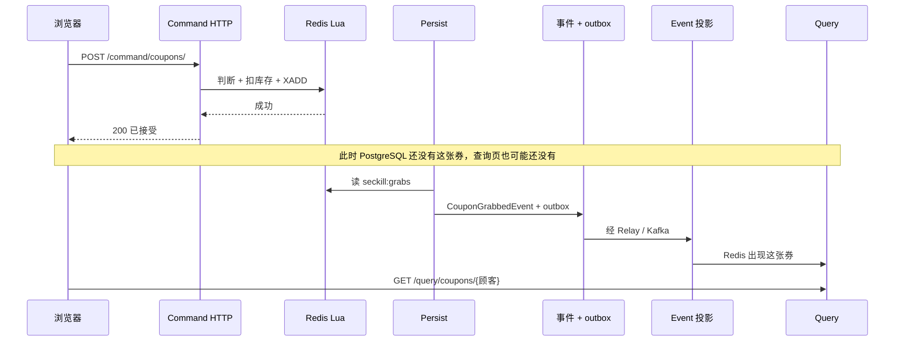
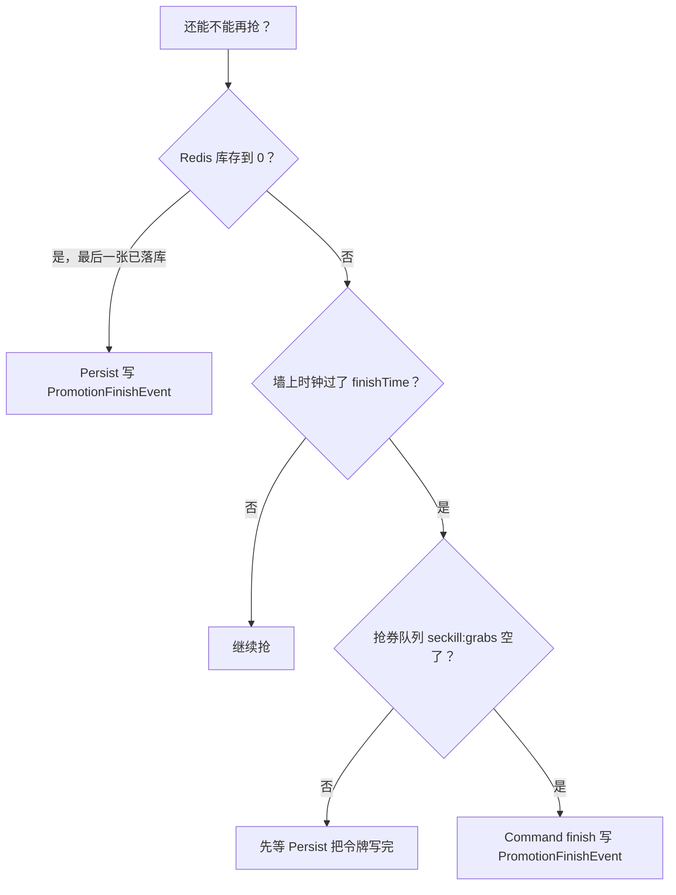

# 第 9 课：三种事件怎么流转

前八课已经分别看过创建、抢券、落库和查询。本课把三种事件放在一张图上：各自表示什么事实、谁写入、后半段怎样走到查询页。

三种事件记的都是**已经发生的事实**，不是运营在 Admin 里点的按钮。创建活动只插活动配置行，不会产生这三种事件。

## 要打开的文件

1. `service/seckill-command-service/src/main/java/io/servicecomb/poc/demo/seckill/SecKillPromotionBootstrap.java`  
   搜索 `PromotionStartEvent` 和 `finish()`。
2. `service/seckill-command-service/src/main/java/io/servicecomb/poc/demo/seckill/SecKillCommandService.java`  
   看 `addCouponTo`（不写事件）和 `finish()`（到点结束）。
3. `service/seckill-persist-service/src/main/java/io/servicecomb/poc/demo/seckill/persist/GrabPersistWorker.java`  
   看抢券事件，以及最后一张时的结束事件。
4. `service/seckill-event-service/src/main/java/io/servicecomb/poc/demo/seckill/EventProjector.java`  
   看 `apply` 对三类事件各写 Redis / Elasticsearch 的哪一块。

## 一句话对照

| 事件 | 这句话成立时才写 | 谁写 | 投影之后查询侧 |
|------|------------------|------|----------------|
| `PromotionStartEvent` | Redis 里**已经有库存键**，可以开抢 | Command 引导器（到 `publishTime`） | Redis 活动列表出现这场；ES 有活动文档 |
| `CouponGrabbedEvent` | 某人**已经在 Redis 扣到库存**，Persist 把这件事记进账本 | Persist（消费 `seckill:grabs`） | Redis「我的券」多一张；ES 可搜到这张券 |
| `PromotionFinishEvent` | 这场**已经收尾**：卖完，或到点且抢券队列已空 | Persist（最后一张）或 Command（到点） | Redis 活动列表拿掉这场；ES 活动标 `finished` |

Admin 只负责活动配置。开始事件不是「运营创建了活动」，结束事件也不是「运营点了结束」。

## 后半段共用一条路

三种事件的后半段相同：同一事务写事件表和 outbox，提交后 Relay 发 Kafka，Event 服务投影到 Redis 和 Elasticsearch。Writer 自己不发 Kafka。

Command 用 `TransactionalEventOutboxWriter` 写开始和到点结束。Persist 用 `PersistOutboxWriter` 写抢到和卖完结束。规则一样，调用方和事件类型不同。



## PromotionStartEvent：库存挂上了

**作用：** 告诉后面的人「热路径已经就绪」。Query 用它把活动放进「进行中」列表。Admin 用它判断「已经开始，不能再改配置」。

不会在创建时写。运营 10:00 创建、`publishTime` 是 12:00，中间只有活动表一行，事件表是空的。



到这里：Redis 有 `seckill:stock:{活动}`，查询页才能列出这场。用户还没抢，所以没有券事件。上图是事件表还是空的、第一次挂库存。

库存键后来丢了（数据卷没了，或测试用的内存 Redis 重启），引导器改走回补，**不再写第二条** `PromotionStartEvent`：



只在抢券队列里、还没落库的券，回补补不回来。查询读模型要另走第 8 课的回放。

## CouponGrabbedEvent：账本记下谁抢到了

**作用：** 权威记录「这场活动、这个人、抢到一张」。查询「我的券」和搜索都靠它的投影，不靠抢券那一次 HTTP。

抢券 HTTP 和这条事件是错开的：



200 只表示 Redis 扣成功了。页面上看到券，要等 Persist → Relay → Event。这是预期延迟，不是漏写。

同一活动同一人再抢：Lua 看已抢集合，直接失败，不再写第二条抢券事件。

## PromotionFinishEvent：这场结束了

**作用：** 查询列表不再展示这场；ES 里活动打上已结束。已经发出的券还在，不会删。

有两条触发，都只写一次（按活动编号加类型查重）：



- **卖完：** 最后一张令牌 Persist 写完 `CouponGrabbedEvent` 后，立刻再写结束。这时往往还没到 `finishTime`。
- **到点：** 时钟到了，但队列里可能还有「已扣 Redis、未写库」的令牌。必须排空再结束，否则会漏账。

投影：Redis 从进行中活动里删掉这场；ES 不删文档，只加 `"finished": true`。键和字段见 [第 8 课](08-查询和回放.md)。

## 串成一次完整秒杀

假设 5 张券，12:00 开抢，18:00 结束，用户甲乙抢到，其余卖完：

```text
10:00  Admin 建活动
        只有活动表。三种事件都还没有。不能抢。

12:00  Command 初始化 Redis
        ① PromotionStartEvent
        查询列表出现这场。

12:01  甲抢到（HTTP 200）
        稍后 Persist ② CouponGrabbedEvent（甲）
        再稍后查询「甲的券」才有。

12:02  乙抢到
        ② CouponGrabbedEvent（乙）

……    第 5 张落库
        ② CouponGrabbedEvent（最后一人）
        ③ PromotionFinishEvent（Persist，卖完）
        查询列表拿掉这场。甲乙的券还在。
```

若 18:00 到了还剩库存：不会走「卖完」那条，而等队列空了由 Command 写 ③。

## 和三条用户操作的关系

```text
创建活动 ──▶ 只写活动表 ──▶ 还没有事件
抢券     ──▶ 只扣 Redis ──▶ 事后才有 CouponGrabbedEvent
查询     ──▶ 只读投影   ──▶ 三种事件都被 Event 服务「翻译」过了
```

三种事件都是给后面的人用的：Query 拼页面、Admin 判断能不能改、Command 恢复空 Redis、回放重建读模型。抢券那一下不读事件表。

## 核对

合上资料，试着回答：

1. 运营点「创建活动」时，会不会立刻写出 `PromotionStartEvent`？为什么？
2. 抢券 HTTP 200 时，`CouponGrabbedEvent` 是否一定已经在 PostgreSQL 里？
3. `PromotionFinishEvent` 可能由哪两个进程写出？各自对应什么条件？
4. 三种事件写进 PostgreSQL 之后，谁负责让查询页看见变化？

上一课：[08-查询和回放.md](08-查询和回放.md)。接下来如果要继续深入，优先读 `SecKillRecoveryService`（Redis 空了时按事件表重建库存）和 `library/seckill-infra-redis` 里的 Lua 脚本文本。
